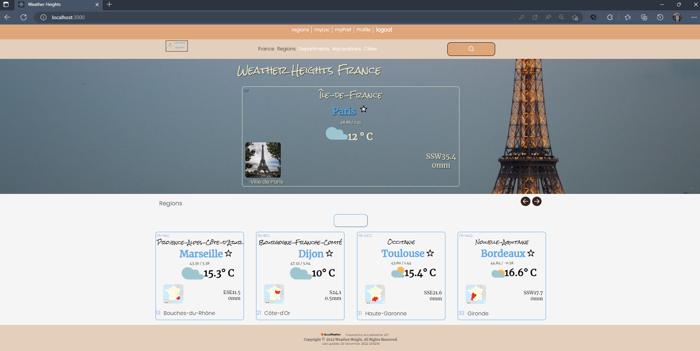

# Installatie Handleiding Weather Heights
React applicatie voor weeradvies,
Versie 2.0

## Inhoudsopgave

1. Inleiding
2. Lijst van benodigdheden om de applicatie te kunnen gebruiken
3. Randvoorwaarden
4. Andere beschikbare npm commando’s
5. Stappenplan

## Inleiding

Er zijn natuurlijk al heel veel applicaties te vinden via welke men het weer kan opvragen en via google is waarschijnlijk al heel veel te vinden. Maar een locatie zoeken afhankelijk van het gewenste weer is misschien toch een iets andere optiek, vooral als men de locatie nog niet weet en die wil laten afhangen van het weer.
De applicatie ‘Weather Heights’ kan hier misschien bij helpen. Op het hoofdscherm ziet de gebruiker eerst de hoofdstad van Frankrijk met een korte weerflash en onderaan de pagina vier tegels met vier hoofdregio's van Frankrijk, ook met hoofdstad en korte weerflash. Men kan kunt indien gewenst via See More button de weerdetails van Parijs zien, maar ook kan men via de search button een stad in Frankrijk zoeken.
Via 'Register' in de navigatie balk kan de gebruiker een account aanmaken en via 'Login' inloggen.
De gebruiker kan ook een aantal locaties in Frankrijk als favoriet te markeren om ze later met elkaar te kunnen vergelijken.
Er wordt gebruikt gemaakt van de "NOVI backend" om standaard gebrukers gegevens in op te slaan voor het registreren en inloggen.

De keuzes die de user heeft heeft zijn:

1. Verder bladeren door regios's en departementen,
2. Zoeken via City Name,
3. Locatie als Favoriet markeren,
4. Locaties vergelijken ( als de gebruiker geautoriseerd is),
4. Registreren account,
5. Aanloggen naar dit account en weer uitloggen,
6. Profielgegevens bekijken.

Het project is opgezet met Create React App.

## Lijst van benodigdheden om de applicatie te kunnen gebruiken:

NPM en Parcel zijn al geconfigureerd, de bijbehorende dependencies moet men wel nog  installeren.
Omdat er al een package.json aanwezig is in het bestand, kunt u dit doen met het volgende (globale) commando:

* npm install

Er moet een eigen .env bestand in de rootmap aangemaakt worden en gevuld worden met de beschikbaargestelde API key. Ken de waarde hiervan toe aan de variabele-naam REACT_APP_API_KEY zoals beschreven in .env.dist bestand.
Run daarna in Webstorm terminal het comando:
* npm run build

Axios staat ook in de package.json en het is dus niet meer nodig om het te installeren.
React en React-router staan al in de package.json en het is dus ook niet meer nodig deze te installeren.

Alle benodigde dependencies worden al binnengehaald!

Als u dit hebt gedaan kunt u de Weather Heights applicatie starten. Doe dat in de terminal van Weather Heights met het volgende commando:
* npm run start

Authenticatie

Registreren en inloggen is mogelijk en is nodig voor de Compare functionaliteit in het scherm myPreferences, waarmee u de favoriete locaties kunt vergelijken.
Registreer een account voor u gaat inloggen.
Een gedeelte van de content is alleen beschikbaar voor ingelogde gebruikers (zoals bijvoorbeeld een profiel-pagina). Gebruikers kunnen zich zowel registreren als inloggen. Hiervoor wordt gebruik gemaakt van React Context en de NOVI-backend. De backend draait op een Heroku server. Let op: de database met gebruikers wordt vaak binnen één uur weer geleegd. Dus u moet zelf eerst een account aanmaken en hiermee inloggen. Let hierbij op de volgende vereisten:
* Het emailadres moet daadwerkelijk een @ bevatten
* Het wachtwoord en gebruikersnaam moeten minimaal 6 tekens bevatten.
 
JWT-decode wordt gebruikt voor het coderen en decoderen van 'tokens' en staat al in de package.json en het is dus niet meer nodig het te installeren.

## Randvoorwaarden

* Webstorm moet geïnstalleerd zijn op de computer om al de genoemde ‘terminal’ commando’s te kunnen uitvoeren. Webstorm is de IDE (Integrated Development Environment)die gebruikt is om code in te programmeren. De structuur van de webpagina’s is opgezet met behulp van HTML versie 5, en de styling is gebeurd met CSS. Met Javascript en React is er logica aan toegevoegd voor de interactie met de gebruiker. Het project bevat de JavaScript linter ESLint (Bij gebruik van create-react-app is dit standaard meegeleverd). Er wordt gebruik gemaakt van herbruikbare React elementen, zoals State, Router, Component Lifecycle en Context.
* De code is beheerd met behulp van GIT.
  GIT is het VCS, distributed version control system, dat gebruikt is. De applicatie staat op een GITHUB repository, en dus is het handig als GIT geïnstalleerd is op uw computer om de applicatie te kunnen clonen in Webstorm.

* Op basis van de informatie uit de Accuweather API, moet er een API key gebuikt worden. In elke javascript met een fetch erin die ik volgens mijn user profile mag gebruiken.
  De API key die ik gebruik kent u toe aan de environmental variabele REACT_APP_API_KEY in het .env bestand in de rootmap. De betreffende environmental variabele is ook genoemd in het .env.dist bestand in de rootmap. Daarnaast heb ik nog een environmental variabele gecreëerd REACT_APP_API_OW_KEY in het .env bestand, special voor test doeleinden om te gebruiken in combinatie met de "Open Weather" endpoint, maar die hebt u niet nodig.

## Andere beschikbare npm commando’s

De volgende NPM commando’s zijn ook beschikbaar en kunt u afhankelijk van bepaalde situatie ook nog gebruiken:
* npm -v

Checken of NPM geïnstalleerd is via commando in de terminal van webstorm.
Als het geinstalleerd is, ziet vervolgens het nummer van de huidige geïnstalleerde versie op uw computer, zoals bijvoorbeeld 6.4.1.
* npm init

NPM initialiseren als NPM nog niet geconfigureerd is.

* npm i parcel --save-dev
  Parcel installeren

* npm i parcel-plugin-nuke-dist --save-dev
  Parcel plugin Nuke Distribution installeren.
  Vervolgens om dat parcel nog niet geconfigureerd was moet de men de Script tag vervangen in package.json
  "scripts": { "start": "parcel src/index.html", "build": "parcel build src/index.html" }

* npm i axios
  Als Axios nog niet geconfigureerd is en als u een request wil maken naar een API dan kunt u hiervoor Axios installeren. Dit moet men doen als Axios nog niet in het package.json staat.
* node -v

Node kan men gebruiken als run-time engine om Javascript code buiten de browser uit te voeren. 
* Installeren van Node.js kan via de website "https://nodejs.org/en/download/". Download en installeer.

* Met dit commando test u of de installatie succesvol was. Als Node.js aanwezig is zult u een versienummer te zien krijgen, zoals bijvoorbeeld v13.9.3.
* node voorbeeld.js

Als node.js aanwezig is kan men een Javascript code bestand uitvoeren en output zien in de terminal van webstorm via console.log.
* npm install -g nodemon

‘nodemon’ installeren, een extensie die ervoor zorgt dat JavaScript één keer aanroepen resulteert in een run bij elke save.
* nodemon voorbeeld.js

javascript bestandje uitvoeren in de terminal en direct nieuwe output in de terminal zien verschijnen als men het javascript bestand aangepast. Stoppen met CTRL + C.
Als u geen administrator gebruiker dan deze extensie toevoegen.
* Set-ExecutionPolicy RemoteSigned

Hetvolgende commando is nodig om jwt decode te kunnen importeren en tokens te kunnen decoderen en is dus al uitgevoerd voor de Weather Heights applicatie.
* npm install jwt-decode
    
Om react Router te kunnen gebruiken hebben we het volgende comando nodig en al uitgevoerd:
* npm install react-router-dom@5.2.0

## Stappenplan

Om de applicatie Weither Heighst te installeren op een laptop of personal computer, moeten na de installatie van Webstorm de volgende stappen ondernomen worden.

1. Webstorm:
   Creëer een nieuw project in Webstorm met “Create new project from version control”;
2. GitHub:
   ‘Copy’ de repository link van het project dat beschikbaar is onder:
   HeCu22/frontend-react-weather-heights (github.com) https://github.com/HeCu22/frontend-react-weather-heights
3. Webstorm:
   New project from Version Control,
   ‘Paste’ de url sub 2. in Webstorm in de popup om een nieuw project ‘from version control’ te creeren,
   Click button:
   clone
   Click:
   confirm trusting
   Selecteer:
   new window
4. Webstorm Terminal:
   Verwijder de link met de remote en type het comando:
   git remote remove origin

5. Webstorm Terminal:
   Installeer de packages die included zijn in package.json van Weather Heights.
   Enter het commando:
* npm install

6. API key

De API key die ik gebruik is ....... en deze kent u toe aan de environmental variabele REACT_APP_API_KEY in het .env bestand in de rootmap. De betreffende environmental variabele is ook genoemd in het .env.dist bestand in de rootmap.
Bij deze applicatie maak ik gebruik van HTTP requests naar de Accuweather API (....ttps://accuweather.com/.....) om zo de juiste data op te vragen en te verwerken in mijn applicatie. De documentatie over de verschillende endpoints kunt u hier vinden.
In deze versie is voor het testen ook gebruik gemaakt van de endpoints:
* Current Conditions endpoint: "http://dataservice.accuweather.com/currentconditions/v1/${locationKey}?apikey=${process.env.REACT_APP_API_KEY}&details=true"
* City Search (results narrowed by countryCode): "http://dataservice.accuweather.com/locations/v1/cities/search?apikey={process.env.REACT_APP_API_KEY}&q={city)&offset=25"
* 5 Days of Daily Forecasts: "https://dataservice.accuweather.com/forecasts/v1/daily/5day/{locationKey}?apikey={process.env.REACT_APP_API_KEY}&details=true&metric=true"

Het "Open weather" endpoint dat ik gebruik om te testen is: "...ttp://api.openweathermap.org/data/2.5/weather?id=${mylocations[indexI].key}&lang=en&appid=${process.env.REACT_APP_API_OW_KEY}&units=metric"

7. Webstorm Weather Heights:
Maak een eigen .env bestand in de rootmap aan en vul deze met de variabel-namen zoals beschreven in .env.dist bestand en ken daar bovengenoemde apiKey aan toe.
Run daarna in Webstorm terminal het comando:
* npm run build

Bovenstaand comando in de webstorm terminal zorgt ervoor dat de goede APIkey gaat werken.

8. Webstorm
   · vervolgens run met commando:
   * npm run start
   · vervolgens ziet u een link verschijnen zoals: ‘https://localhost:3000’
   Click op de link.
   · Vervolgens ziet u het hoofdmenu van Weather Heights.
