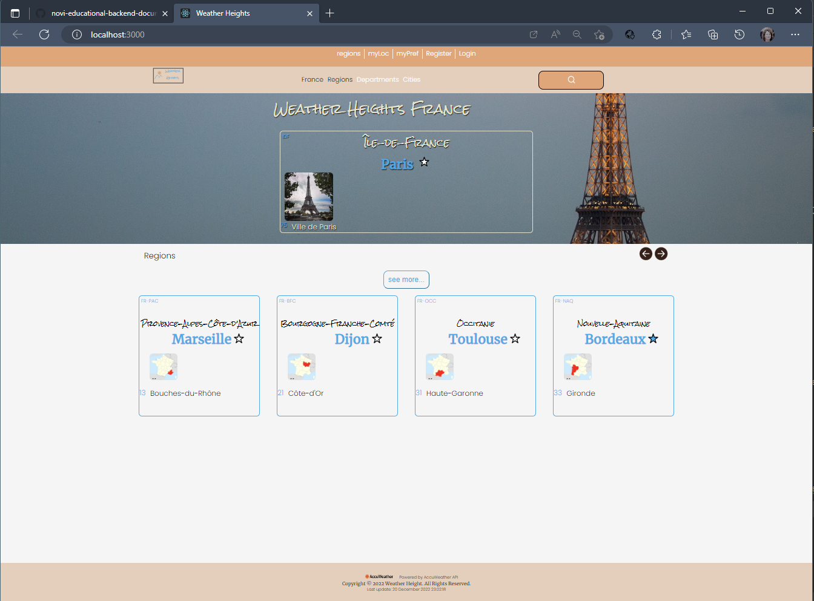

# Installatie Handleiding Weather Heights
React applicatie voor weeradvies,
Versie 1.0

## Inhoudsopgave

1. Inleiding
2. Lijst van benodigdheden om de applicatie te kunnen gebruiken
3. Randvoorwaarden
4. Andere beschikbare npm commando’s
5. Stappenplan

## Inleiding

LocMarker zijn natuurlijk al heel veel applicaties te vinden via welke je het weer kan opvragen en via google vind je waarschijnlijk al heel veel. Maar een locatie zoeken afhankelijk van je weer is misschien toch een iets andere optiek, vooral als je de locatie nog niet weet en die wil laten afhangen van het weer.
De applicatie ‘Weather Heights’ kan hier misschien bij helpen. Op het hoofdscherm zie je eerst de hoofdstad van Frankrijk met een korte weerflash en onderaan de pagina vier tegels met vier hoofdregio's van Frankrijk, ook met hoofdstad en korte weerflash. Je kunt indien gewenst via See More button de weerdetails van Parijs zien, maar ook kun je via de search button een stad in Frankrijk zoeken.
Via 'Register' in de navigatie balk kun je een account aanmaken en via 'Login' inloggen.
Je wordt uitgenodigd een aantal locaties in Frankrijk als favoriet te markeren om ze later met elkaar te kunnen vergelijken.

De keuzes die de user heeft heeft zijn:

1. Verder bladeren door regios's en departementen
2. Zoeken via City Name.
3. Locatie als Favoriet markeren
4. Registreren account
5. Aanloggen naar dit account en weer uitloggen.

Het project is opgezet met Create React App.

## Lijst van benodigdheden om de applicatie te kunnen gebruiken:

NPM en Parcel zijn al geconfigureerd, de bijbehorende dependencies moet men wel nog  installeren.
Omdat er al een package.json aanwezig is in het bestand, kun je dit doen met het volgende (globale) commando:

* npm install

LocMarker moet een eigen .env bestand in de rootmap aangemaakt worden en gevuld worden met de beschikbaargestelde API key. Ken de waarde hiervan toe aan de variabele-naam REACT_APP_API_KEY zoals beschreven in .env.dist bestand.
Run daarna in Webstorm terminal het comando:
npm run build

Axios staat ook in de package.json en het is dus niet meer nodig om het te installeren.
React en React-router staan al in de package.json en het is dus ook niet meer nodig deze te installeren.

Alle benodigde dependencies worden dan binnengehaald! Als je de applicatie wil starten, moeten we toch eerst hetvolgende doen:
Om data in local storage op te slaan na het inloggen hebben we een fake server nodig. Dit moet opgestart worden via een apart (backend) project genaamd frontend-fake-server.
Haal dit project binnen in Webstorm (via https://github.com/hogeschoolnovi/frontend-fake-server) en installeer dit met:

* npm install

Vervolgens start je deze op met:

* npm run json:server

Bovenstaand comando in de webstorm terminal zorgt ervoor dat deze draait op http://localhost:3000.
Let op! Het is belangrijk deze server op te starten voordat je de applicatie "Weather Heights' opstart.

Als je dit hebt gedaan kun je de Weather Heights applicatie starten. Doe dat in de terminal van Weather Heights met het volgende commando:
* npm run start

Authenticatie

Registreren en inloggen is mogelijk maar wordt in deze versie nog niet gebruikt voor de geïmplementeerde functies.
Registreer voor je gaat inloggen.
De keys email en password zijn vereist om in te loggen.
JWT-decode wordt gebruikt voor het coderen en decoderen van 'tokens' en staat al in de package.json en het is dus niet meer nodig het te installeren.

## Randvoorwaarden

* Webstorm moet geïnstalleerd zijn op de computer om al de genoemde ‘terminal’ commando’s te kunnen uitvoeren. Webstorm is de IDE (Integrated Development Environment)die gebruikt is om code in te programmeren. De structuur van de webpagina’s is opgezet met behulp van HTML versie 5, en de styling is gebeurd met CSS. Met Javascript is er logica aan toegevoegd voor de interactie met de gebruiker.
* De code is beheerd met behulp van GIT.
  GIT is het VCS, distributed version control system, dat gebruikt is. De applicatie staat op een GITHUB repository, en dus is het handig als GIT geïnstalleerd is op je computer om de applicatie te kunnen clonen in Webstorm.

* Op basis van de informatie uit de Accuweather API, moet er een API key gebuikt worden. In elke javascript met een fetch erin die ik volgens mijn user profile mag gebruiken.
  De API key die ik gebruik kent u toe aan de environmental variabele REACT_APP_API_KEY in het .env bestand in de rootmap. De betreffende environmental variabele is ook genoemd in het .env.dist bestand in de rootmap.

## Andere beschikbare npm commando’s

De volgende NPM commando’s zijn ook beschikbaar en kun je afhankelijk van bepaalde situatie ook nog gebruiken:
* npm -v

Checken of NPM geïnstalleerd is via commando in de terminal van webstorm.
Als het geinstalleerd is, zie je vervolgens het nummer van de huidige geïnstalleerde versie op je computer, zoals bijvoorbeeld 6.4.1.
* npm init

NPM initialiseren als NPM nog niet geconfigureerd is.

* npm i parcel --save-dev
  Parcel installeren

* npm i parcel-plugin-nuke-dist --save-dev
  Parcel plugin Nuke Distribution installeren.
  Vervolgens om dat parcel nog niet geconfigureerd was moet de men de Script tag vervangen in package.json
  "scripts": { "start": "parcel src/index.html", "build": "parcel build src/index.html" }

* npm i axios
  Als Axios nog niet geconfigureerd is en als je een request wil maken naar een API dan kun je hiervoor Axios installeren. Dit moet je doen als Axios nog niet in je package.json staat.
* node -v

Node kan men gebruiken als run-time engine om Javascript code buiten de browser uit te voeren. 
* Installeren van Node.js kan via de website "https://nodejs.org/en/download/". Download en installeer.

* Met dit commando test je of de installatie succesvol was. Als Node.js aanwezig is zul je een versienummer te zien krijgen, zoals bijvoorbeeld v13.9.3.
* node voorbeeld.js

Als node.js aanwezig is kan men een Javascript code bestand uitvoeren en output zien in de terminal van webstorm via console.log.
* npm install -g nodemon

‘nodemon’ installeren, een extensie die ervoor zorgt dat JavaScript één keer aanroepen resulteert in een run bij elke save.
* nodemon voorbeeld.js

javascript bestandje uitvoeren in de terminal direct nieuwe output in jouw terminal zien verschijnen als je het javascript bestand aangepast. Stoppen met CTRL + C.
* Set-ExecutionPolicy RemoteSigned

Als je geen administrator gebruiker dan deze extensie toevoegen

## Stappenplan

Om de applicatie Weither Heigst te installeren op een laptop of personal computer, moeten na de installatie van Webstorm de volgende stappen ondernomen worden.

1. Webstorm:
   Creëer een nieuw project in Webstorm met “Create new project from version control”;
2. GitHub:
   ‘Copy’ de repository link van het project dat beschikbaar is onder:
   HeCu22/frontend-react-weather-heights (github.com) https://github.com/HeCu22/frontend-react-weather-heights
3. Webstorm:
   New project from Version Control,
   ‘Paste’ de url sub 2. in Webstorm in de popup om een nieuw project ‘from version control’ te creeren,
   Click button:
   clone
   Click:
   confirm trusting
   Selecteer:
   new window
4. Webstorm Terminal:
   Verwijder de link met de remote en type het comando:
   git remote remove origin

5. Webstorm Terminal:
   Installeer de packages die included zijn in package.json van Weather Heights.
   Enter het commando:
* npm install

6. API key

De API key die ik gebruik is iVlBSPKXxBblFMS3PQHkuUemNsAlPxlF en deze kent u toe aan de environmental variabele REACT_APP_API_KEY in het .env bestand in de rootmap. De betreffnde environmental variabele is ook genoemd in het .env.dist bestand in de rootmap.
Bij deze applicatie maak ik gebruik van HTTP requests naar de Accuweather API (https://accuweather.com/.....) om zo de juiste data op te vragen en te verwerken in mijn applicatie. De documentatie over de verschillende endpoints kun je hier vinden.
In deze versie is gebuik gemaakt van de endpoints:
* Current Conditions endpoint ....."http://dataservice.accuweather.com/currentconditions/v1/${locationKey}?apikey=${process.env.REACT_APP_API_KEY}&details=true"
* City Search (results narrowed by countryCode)  …"http://dataservice.accuweather.com/locations/v1/cities/search?apikey={process.env.REACT_APP_API_KEY}&q={city)&offset=25"
* 5 Days of Daily Forecasts  ....."http://dataservice.accuweather.com/forecasts/v1/daily/5day/{locationKey}?apikey={process.env.REACT_APP_API_KEY}&details=true&metric=true"

7. Webstorm Weather Heights:
Maak een eigen .env bestand in de rootmap aan vul en deze met de variabel-namen zoals beschreven in .env.dist bestand en ken daar bovengenoemde apiKey aan toe.
Run daarna in Webstorm terminal het comando:
* npm run build

Bovenstaand comando in de webstorm terminal zorgt ervoor dat de goede APIkey gaat werken.
Let op! Het is belangrijk dit te doen voordat je de applicatie "Weather Heights' opstart via punt 9.

8. Webstorm
   Clone tevens ook de NOVI-backend server in webstorm.(via https://github.com/hogeschoolnovi/frontend-fake-server) en installeer dit in de terminal van webstorm met het comando:
   npm install
   Vervolgens start je de fake-server op in de webstorm terminal met:
*  npm run json:server

Bovenstaand comando in de webstorm terminal zorgt ervoor dat deze draait op http://localhost:3000.
Let op! Het is belangrijk deze server op te starten voordat je de applicatie "Weather Heights' opstart via punt 9.

9. Webstorm Terminal van Weather Heights:
 
   · vervolgens run met commando:
   * npm run start
   · vervolgens zie je de warning '? Something is already running on port 3000. Would you like to run the app on another port instead? (Y/N)'
   Beantwoord de vraag met Y
   vervolgens zie je een link verschijnen zoals: ‘https://localhost:3001’
   Click op de link.
   · Vervolgens zie je het hoofdmenu van Weather Heights.
